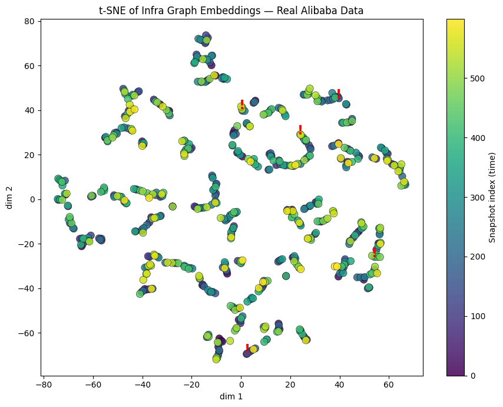

# infra-jepa

**What if your infrastructure could tell you what it didn't expect?**

Most observability tools are built around a simple premise: define what failure looks like, set a threshold, alert when it's crossed. It's a reasonable approach — with a fundamental blind spot. It can only find the failures you anticipated.

This project explores a different question entirely.

Inspired by [LeWorldModel](https://le-wm.github.io/) (Maes, Le Lidec, LeCun et al., 2026), infra-jepa applies a Joint Embedding Predictive Architecture to infrastructure graphs. The model learns what normal infra transitions look like — and measures surprise when reality diverges from expectation. No rules. No manually defined failure modes. A learned sense of normal.

[](https://colab.research.google.com/github/jdavidaguil/infra-jepa/blob/main/infra_jepa_colab.ipynb)

---

## What it found

Tested on Alibaba's public microservice trace 2022. Real production data. 600 five-minute snapshots across two days. 16,000+ unique services.

**5 anomalies detected out of 599 transitions scored.**

The two highest-scoring events had the same structural fingerprint:
- 130+ services churned in a single 5-minute window
- 200+ call edges reshuffled simultaneously
- CPU normal. Memory normal. Surface latency normal.

Traditional monitoring sees nothing there. The anomaly is in the *shape* of the dependency graph — which services were talking to which, which had appeared, which had vanished.

**Then we cross-referenced with response time data the model never trained on.**

Every flagged window showed elevated p95 latency compared to its neighbors. The clearest example: three consecutive windows at a steady 28ms p95, the anomaly window at 38.9ms, then immediately back to normal. Two independent signals pointing at the same windows.


*Surprise scores across 599 transitions. Red bars are structural topology events — invisible to CPU, memory, and latency monitors.*


*t-SNE of infra graph embeddings. Anomalies (red markers) sit at structural boundaries between clusters.*

---

## Architecture

```
MSCallGraph + MSResource
        │
        ▼
  Graph Snapshots (5-min windows)
        │
        ▼
  GraphSAGE Encoder → z_t → MLP Predictor → ẑ_{t+1}
                       │                         │
                       └──────── Loss ────────────┘
                           MSE(ẑ_{t+1}, z_{t+1})
                         + λ · SIGReg(z_t, z_{t+1})
```

- **Encoder**: 2-layer GraphSAGE + global mean pooling → 32-D embedding per snapshot
- **Predictor**: 2-layer MLP with residual connection — learns infra dynamics in latent space
- **SIGReg**: Gaussian regularizer from LeWM — prevents representation collapse with a single loss term. Replaces 5+ loss terms from prior approaches.
- **Anomaly score**: L2 distance between predicted and actual next embedding

---

## Quickstart

No local setup needed. Runs entirely in Google Colab on a free T4 GPU.

1. Click the **Open in Colab** badge above
2. Set runtime to **T4 GPU** (Runtime → Change runtime type)
3. Run all cells — about 15 minutes end to end

The notebook will:
- Download real Alibaba Microservice Trace 2022 data directly (~570MB)
- Build graph snapshots at 5-minute intervals
- Train the JEPA model (100 epochs)
- Score anomalies and produce visualizations
- Run structural diagnosis on flagged transitions

---

## Run summary

| Metric | Value |
|---|---|
| Dataset | Alibaba Microservice Trace 2022 |
| Snapshots | 600 × 5-min windows |
| Avg nodes / snapshot | 242 microservices |
| Avg edges / snapshot | 305 call edges |
| Final prediction loss | 0.0092 |
| Transitions scored | 599 |
| Anomalies detected | 5 |
| Threshold | mean + 3σ = 1.228 |

---

## Dataset

[Alibaba Microservice Trace 2022](https://github.com/alibaba/clusterdata/tree/master/cluster-trace-microservices-v2022) — publicly available production cluster traces.

| Table | Description | Size (compressed) |
|---|---|---|
| MSCallGraph | Service-to-service call edges + latency | ~212MB / hour |
| MSResource | Per-service CPU and memory utilization | ~355MB / hour |

---

## Honest scope

This is one experiment on one public dataset. There is no ground truth — we cannot confirm the flagged transitions were real incidents. What we can say is that two independent signals (structural topology change + latency elevation) pointed at the same windows. That's a meaningful result worth pursuing further.

Open questions:
- Were these incidents or scheduled maintenance events?
- How does the signal hold at larger scale?
- What's the right snapshot granularity for different infra types?
- How does precision/recall look with labeled data?

---

## Inspiration

- **LeWorldModel** (Maes, Le Lidec, LeCun et al., 2026) — stable end-to-end JEPA using SIGReg. [Paper](https://arxiv.org/pdf/2603.19312v1) · [Site](https://le-wm.github.io/)
- **GraphSAGE** (Hamilton et al., 2017) — inductive representation learning on large graphs
- **JEPA** (LeCun, 2022) — A path towards autonomous machine intelligence

---

## Connection to Infragraph

This experiment is a proof of concept for [Infragraph](#) — a project building graph-based intelligence for infrastructure systems. The core thesis: infrastructure should have a world model, not just a dashboard.

---

## License

MIT
