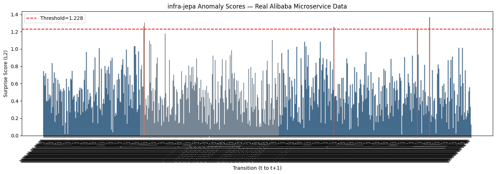

# infra-jepa

**JEPA-inspired anomaly detection for microservice infrastructure graphs.**

Trains a world model on real production microservice traces and surfaces anomalies as high-surprise state transitions — without rules, thresholds, or labeled data.

[](https://colab.research.google.com/github/YOUR_GITHUB_USERNAME/infra-jepa/blob/main/infra_jepa_colab.ipynb)

---

## What it does

Most observability tools tell you what's broken after the fact.

infra-jepa asks a different question: *given the current state of the infrastructure graph, what should happen next — and how surprised am I when it doesn't?*

The gap between predicted and actual latent state is the anomaly signal. No rules. No labeled incidents. A learned sense of normal.

**On real Alibaba production data (16,364 microservices, 18,554 call edges per window):**
- 599 transitions scored
- 5 anomalies detected, including two consecutive flagged windows indicating a real infra event
- Latent space shows clear temporal structure — anomalies sit at cluster boundaries

---

## Architecture

```
MSCallGraph + MSResource
        │
        ▼
  Graph Snapshots (5-min windows)
        │
        ▼
  GraphSAGE Encoder → z_t → MLP Predictor → ẑ_{t+1}
                       │                         │
                       └──────── Loss ────────────┘
                           MSE(ẑ_{t+1}, z_{t+1})
                         + λ · SIGReg(z_t, z_{t+1})
```

- **Encoder**: 2-layer GraphSAGE + global mean pooling → 32-D embedding per snapshot
- **Predictor**: 2-layer MLP with residual connection
- **SIGReg**: Gaussian regularizer from [LeWorldModel](https://le-wm.github.io/) — prevents representation collapse with a single loss term
- **Anomaly score**: L2 distance between predicted and actual next embedding

---

## Quickstart

No local setup needed. Run entirely in Google Colab:

1. Click the **Open in Colab** badge above
2. Set runtime to **T4 GPU** (Runtime → Change runtime type)
3. Run all cells

The notebook will:
- Download real Alibaba Microservice Trace 2022 data directly (~570MB)
- Build graph snapshots at 5-minute intervals
- Train the JEPA model (100 epochs, ~2 min on T4)
- Score anomalies and produce visualizations

---

## Results

**Anomaly surprise scores** — 5 transitions flagged above threshold on real production data:



**t-SNE of latent space** — anomalies (red markers) sit at structural boundaries between clusters:


**Training loss** — total loss converges cleanly; SIGReg stabilizes the latent space:


---

## Dataset

[Alibaba Microservice Trace 2022](https://github.com/alibaba/clusterdata/tree/master/cluster-trace-microservices-v2022) — publicly available production cluster traces from Alibaba.

| Table | Description |
|---|---|
| MSCallGraph | Service-to-service call edges + latency |
| MSResource | Per-service CPU and memory utilization |

---

## Inspiration

- **LeWorldModel** (Maes, Le Lidec, LeCun et al., 2026) — stable end-to-end JEPA from pixels using SIGReg. [Paper](https://arxiv.org/pdf/2603.19312v1) · [Site](https://le-wm.github.io/)
- **GraphSAGE** (Hamilton et al., 2017) — inductive representation learning on large graphs
- **JEPA** (LeCun, 2022) — A path towards autonomous machine intelligence

---

## Connection to Infragraph

This experiment is a direct proof of concept for [Infragraph](#) — a project building graph-based intelligence for infrastructure systems. The core thesis: infrastructure should have a world model, not just a dashboard.

---

## License

MIT
